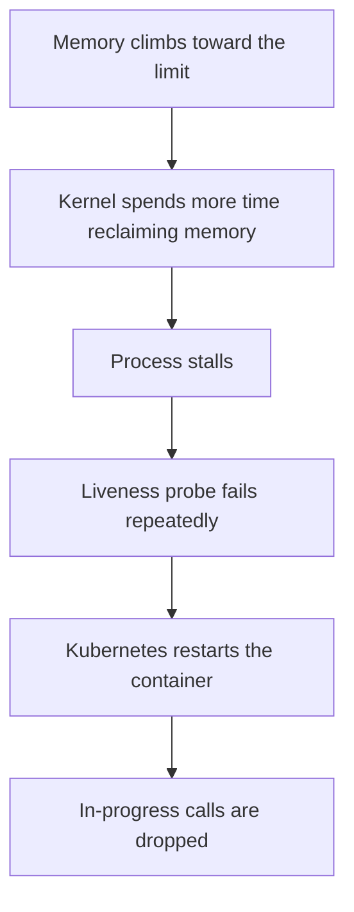
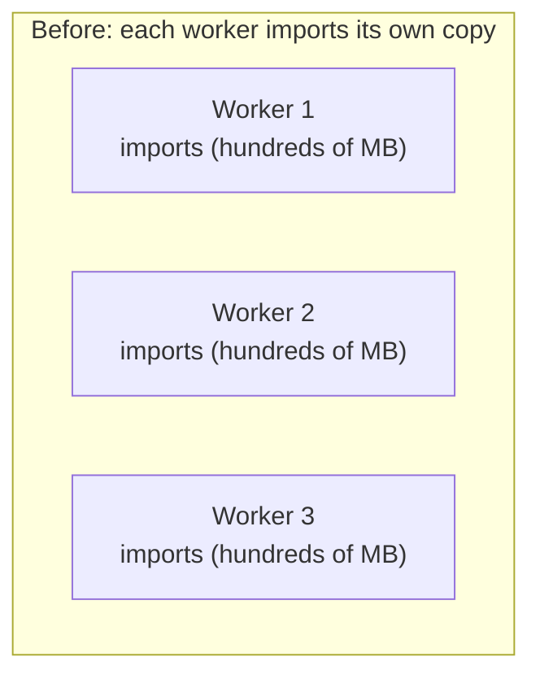
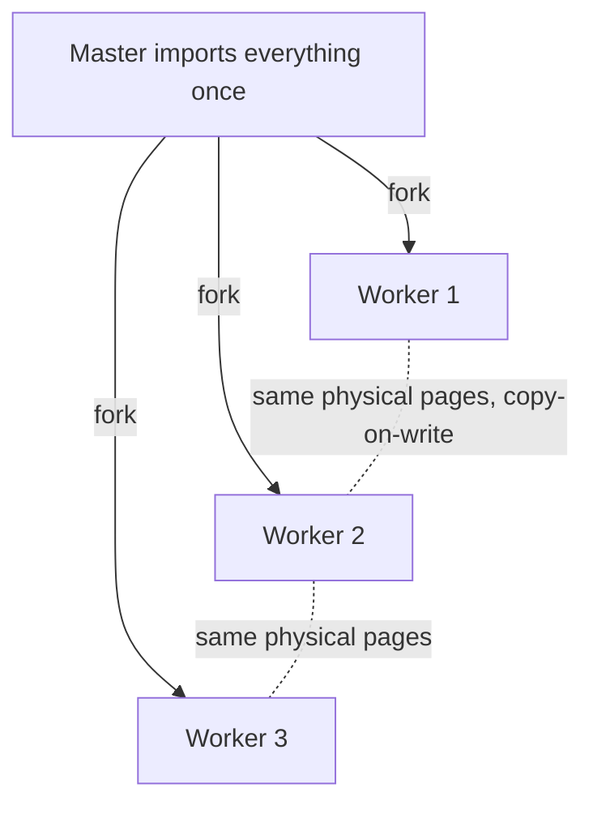

*We run a real-time voice service whose containers were using too much memory and restarting during calls. Two findings: the restarts were liveness-probe timeouts rather than out-of-memory kills, and most of the memory was the same libraries loaded once per worker. Running the workers under a preloading server with copy-on-write sharing addressed both. Here is the reasoning, the fix, and the gotchas.*

## Background

The service handles live voice calls in real time: speech-to-text, an LLM, then text-to-speech, streamed back to the caller. It runs as Kubernetes pods, each pod running several worker processes behind one process manager, with a per-pod memory limit (around 6 GiB) enforced by the Linux cgroup.

One detail shapes everything below: when a pod restarts, the calls in progress on it are dropped. So memory-driven restarts are a reliability problem, not only a cost one.

## Two symptoms, two different problems

We had high memory per pod and frequent restarts. They turned out to be separate issues with separate fixes.

### The restarts were liveness-probe timeouts, not OOM kills

Kubernetes restarts a container for two reasons that look identical from the outside. One is an out-of-memory kill: the container exceeds its memory limit and the kernel kills a process inside it. The other is a failed liveness probe: Kubernetes periodically checks that the container is responsive, and after a few failures it restarts it. Same observable event, different cause, opposite fix.

The out-of-memory path was not firing (no OOM-kill events were recorded). The restarts were liveness failures. As a pod's memory approached the limit, the kernel spent progressively more time reclaiming memory, and that reclaim work stalled the process enough that it could not answer the liveness probe in time. After the probe failed a few times in a row, Kubernetes restarted the container, taking its in-progress calls with it. Memory pressure was the underlying cause, but the actual trigger was an unresponsive container, which is why simply raising the memory limit would have postponed the problem rather than fixed it.

### The memory was mostly the same libraries, loaded per worker

Each worker is a separate operating-system process. When a process imports its libraries, most of what it builds (parsed bytecode, large data tables, client objects, framework state) lives on that process's private heap as anonymous memory. The operating system automatically shares read-only, file-backed pages such as compiled extension binaries across processes, but it does not share that private heap. So if a pod runs several workers and each imports the stack independently, the heap is duplicated once per worker.

In our case the import footprint was several hundred megabytes per worker. With multiple workers per pod, those duplicated imports were the bulk of each pod's memory, which is what pushed pods up to the limit under load and into the restart loop above.

> Hero image: before/after per-pod memory, pinned at the limit and restarting, then stepping down and holding steady.
> 

## The fix: load once, share with copy-on-write

A pre-forking server such as gunicorn runs a master process that forks workers to serve traffic. By default each worker imports the application itself, which produces the duplication above. With preloading enabled, the master imports the application once and then calls `fork()`. A forked child starts as a copy-on-write view of the parent: parent and child share the same physical memory pages, marked read-only, and the kernel only makes a private copy of a page when something writes to it. Code and constant data created during import are read-only at runtime, so they stay shared across every worker.

### Copy-on-write erodes unless you freeze the heap

Sharing only holds while the shared pages stay unwritten, and CPython writes to object memory in two ways. Reference counting updates an object's count field whenever the object is touched, and the cyclic garbage collector's mark phase walks tracked objects and updates a bookkeeping field in each object's header. Both writes dirty the page the object sits on, and a dirtied shared page becomes a private per-worker copy. Left alone, the shared heap drifts back to private over time, and the savings evaporate.

`gc.freeze()` handles the garbage-collector half. Called in the master right before it forks, it moves every object that exists at that point into a permanent generation the collector never scans again, so the collector never writes to those objects and their pages stay shared. Reference-count churn still touches some pages, but import-time objects are mostly long-lived and stable, so the large majority stays shared. This is the technique Instagram described when they hit the same problem.

We verified the effect and measured it with proportional set size (PSS) rather than resident set size (RSS). RSS counts each shared page in full for every process, so summing it across workers double-counts the shared memory; PSS divides each shared page across the processes that share it, so the sum is the true physical footprint. By PSS, adding a second worker cost only tens of megabytes on top of the first, instead of a second full copy.

### One startup-time cleanup

While verifying startup, we found a dependency that fetched a data file over the network on import. We pointed it at the copy bundled with the library instead, which removes a network round-trip from every worker's startup and a boot-time dependency on an external host.

## Forking safely

`fork()` has constraints worth respecting. Only the thread that calls `fork()` exists in the child, and open file descriptors, including sockets, are inherited in a shared state, so anything that opens a socket or starts a background thread at import time is broken or unsafe once workers are forked from a preloaded parent. The rule is to create per-connection resources (database pools, cache clients, background tasks) after the fork, once per worker, rather than at import. Our application already created these in its per-worker startup hook, so preloading was safe; we checked for import-time sockets and threads before shipping.

We rolled out in stages: first a staging instance handling real calls, then a low-traffic region as a canary that we watched for a day, then the main region. The deployment used a rolling update that drains in-progress calls from old pods before terminating them, so the switch itself did not drop any calls.

## A gotcha worth flagging

Frequent restarts hide slow memory growth, because each restart resets the process back to baseline. After the pods became stable, a slower, separate memory growth that the restarts had been masking became visible. The new headroom absorbs it comfortably for now (pods start at a fraction of their old baseline), and we are addressing that growth separately. A scheduled worker recycle, restarting a worker after a fixed number of requests, is a simple interim safety net that reproduces the old reset without restarting the whole pod and dropping calls.

## Results

Sustained over several days, including peak traffic:

- Per-pod memory dropped from sitting at the ~6 GiB limit to roughly 1.3 GB.
- In the canary region, about 38% lower per-pod memory.
- The marginal cost of an extra worker fell to tens of megabytes, versus a full copy, measured by PSS.
- Out-of-memory events: zero. Liveness-driven restarts: effectively eliminated.

## Takeaways

- Identify why a container is restarting before trying to fix it. An out-of-memory kill and a liveness-probe timeout look identical but call for opposite fixes.
- Much of what looks like per-worker memory is duplicated read-only imports. Preloading plus `gc.freeze()` turns N copies into one shared copy.
- Measure shared memory with PSS, not RSS, or you will misread the savings.
- Making a system stable can surface a slower problem that the instability was hiding.

## Further reading

1. Kubernetes, Configure liveness, readiness and startup probes: https://kubernetes.io/docs/tasks/configure-pod-container/configure-liveness-readiness-startup-probes/
2. gunicorn (the pre-fork worker model and preloading): https://gunicorn.org/
3. Python gc.freeze(): https://docs.python.org/3/library/gc.html#gc.freeze
4. Instagram Engineering, Copy-on-write friendly Python garbage collection (the origin of gc.freeze): https://instagram-engineering.com/copy-on-write-friendly-python-garbage-collection-ad6ed5233ddf
5. Rippling, a Gunicorn pre-fork : https://www.rippling.com/blog/rippling-gunicorn-pre-fork-journey-memory-savings-and-cost-reduction
